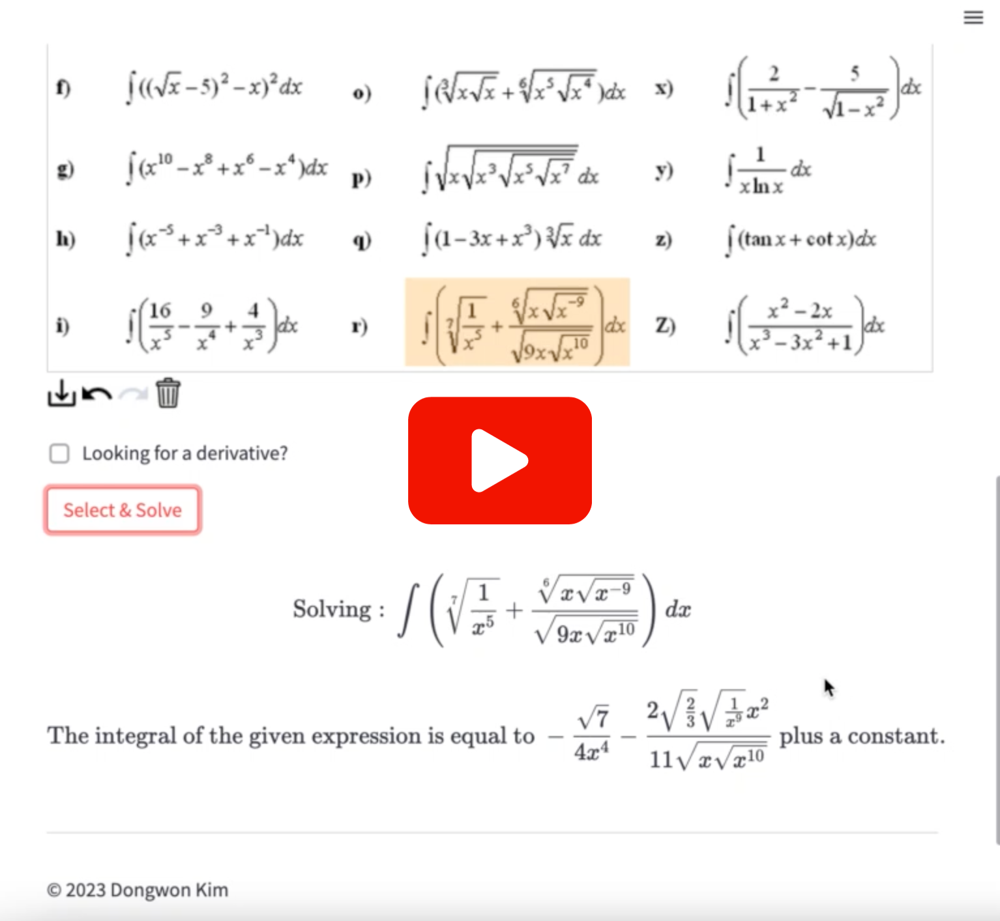

# Snap 'n' Solve - Your Math Assistant

Snap 'n' Solve is a Streamlit app that allows you to solve various math problems from an image. It handles a variety of math problems, including integrals, limits, derivatives, equations, and inequalities.

  

## Features

- Upload an image with a mathematical equation or expression.
- Draw a rectangle around the equation or mathematical expression in the image.
- Find the derivative (1st, 2nd, 3rd order) of the function in the image (optional).
- Solve the equation or find its derivative.

## License

Snap 'n' Solve is licensed under the MIT License. See the [LICENSE](./LICENSE) file for details.
